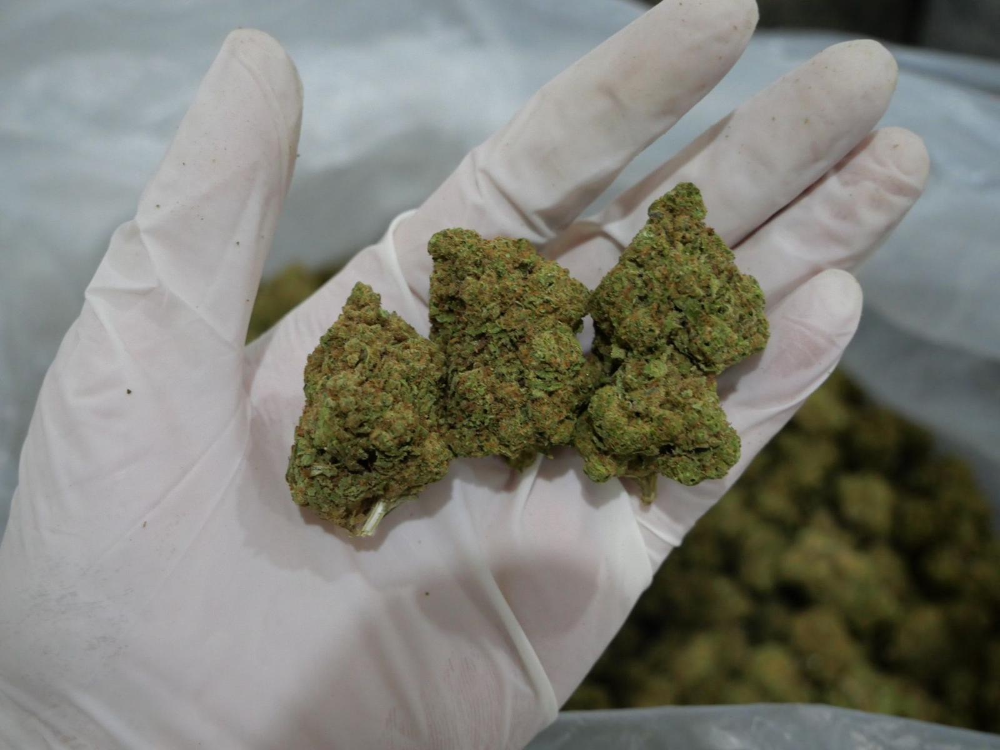

# เขียวสุข — เว็บร้านกัญชา (one-page)

เว็บไซต์ร้านกัญชาคัดเกรดสำหรับผู้ใหญ่ 20+ แบบหน้าเดียว โหลดไว (vanilla HTML/CSS/JS ไม่มีเฟรมเวิร์ก)
ดีไซน์: แนว B "botanical-apothecary" เขียวป่า + ครีมธรรมชาติ พร้อม age gate, สินค้ากรองได้, รีวิว, FAQ, แถบแอดไลน์ลอยติดล่าง

## โครงสร้าง
- `index.html` — ทั้งเว็บอยู่ในไฟล์เดียว (CSS + JS inline)
- `images/` — วางรูปจริงที่นี่

## เปิดดู
ดับเบิลคลิก `index.html` หรือเสิร์ฟด้วยเซิร์ฟเวอร์ใดก็ได้ เช่น:

```
python -m http.server 8000
```

## สิ่งที่ต้องทำต่อ (2 จุด)

1. **ใส่ลิงก์ LINE OA จริง** — แก้ตัวแปร `LINE_URL` ใกล้ท้าย `index.html`
   เช่น `const LINE_URL = 'https://line.me/R/ti/p/@yourid';`
   แล้วปุ่ม "แอดไลน์" ทุกจุดจะลิงก์ทันที

2. **ใส่รูปจริง** — แต่ละช่องรูปมี `<div class="img-fill">` เป็น placeholder
   พร้อมคอมเมนต์ `<!--  -->` กำกับไว้ ให้แทนที่ด้วย `` จริง เช่น:
   ```html
   
   ```
   (Hero 1 รูป + สินค้า 8 รูป: `images/p1.jpg` … `p8.jpg`)

## หมายเหตุ
- หน้ายืนยันอายุจำค่าไว้ใน `localStorage` (กุญแจ `ageok`) — กดครั้งเดียวไม่ต้องกดซ้ำ
- รายชื่อสินค้า/ราคา/รีวิว เป็นตัวอย่างวางเลย์เอาต์ ปรับเป็นของจริงได้เลย
